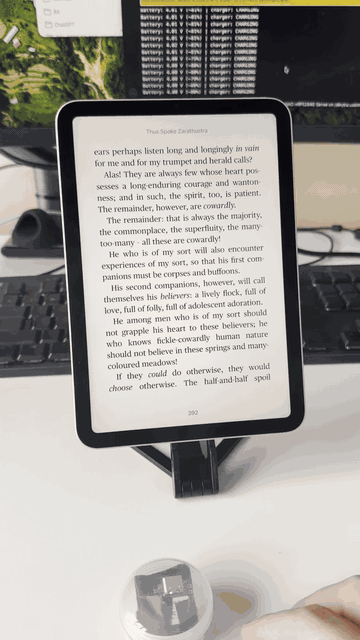

# XIAO Motion Page Turner

A rechargeable, gesture-controlled Bluetooth page-turner built around the
Seeed Studio XIAO nRF52840 Sense.

The remote is tuned for natural reading gestures rather than button presses:

- Swing right-to-left to advance a page, like turning a paper page.
- Swing left-to-right to go back.
- Shake deliberately to wake it; three large blue flashes confirm wake-up.
- Sleep with Bluetooth and the processor off after five idle minutes.
- Turn it face-down to hand the connection between two paired iPads.
- Receive live diagnostics through USB Serial or Nordic BLE UART.
- Adapt gesture thresholds cautiously during each reading session.

The firmware currently targets Apple Books on iPadOS by presenting itself as a
Bluetooth HID keyboard and sending left/right arrow keys.

## Demo

  

## Hardware

- Seeed Studio XIAO nRF52840 Sense
- Protected single-cell 3.7 V LiPo battery (prototype uses 402530, 300 mAh)
- USB-C cable for programming and charging

The gesture-only build does not require external buttons. The onboard LSM6DS3
IMU provides motion sensing.

> [!CAUTION]
> LiPo cells can be damaged by shorts, punctures, heat, or reversed polarity.
> Use a protected cell, insulate the battery foil from the XIAO PCB, and verify
> polarity before connecting USB power. Battery positive goes to `BAT+` and
> negative goes to `BAT-` on the XIAO's rear battery pads.

## Software Setup

1. Install Arduino IDE 2.x.
2. Install Seeed's nRF52 board package.
3. Select **Seeed XIAO nRF52840 Sense**.
4. Install the **Seeed Arduino LSM6DS3** library.
5. Open `firmware/Page_Turner/Page_Turner.ino`.
6. Upload over USB-C.

The tested board package is `Seeeduino:nrf52` 1.1.13 and the tested LSM6DS3
library is 2.0.7.

## Pairing and Use

1. Pair **Roy's Page Turner** in iPadOS Bluetooth settings.
2. Pick it up. The accelerometer wakes the processor, but Bluetooth remains
   disabled until the deliberate wake gesture is confirmed.
3. Shake the remote rapidly back and forth. Three strong blue flashes mean it
   has accepted the gesture and resumed Bluetooth advertising.
4. Hold it calmly for a moment; page gestures are then armed with the LED off.
5. Turn it face-down for three seconds to enter Bluetooth handoff mode. The
   current iPad is refused while another paired iPad connects.

The firmware remembers two hosts. Pairing a third host removes the oldest bond
from the remote.

## Bluetooth Diagnostics

Install Nordic's **nRF Connect for Mobile**, connect to the remote, find the
Nordic UART Service, and enable notifications on its TX characteristic. Messages
include wake impulses, state changes, page turns, handoff decisions, and battery
estimates. The same output remains available through USB Serial at 115200 baud.

## Configuration

User-facing settings are grouped near the top of the sketch. They include:

- Bluetooth name
- Reversed or original page direction
- Motion-inactivity timeout and activity thresholds
- Deep-sleep wake qualification timing
- Page-turn sensitivity
- Shake-to-wake thresholds and timing
- LED timing
- Face-down handoff timing
- Incremental and retry learning

The included defaults were trained from recorded natural page turns, five
deliberate wake shakes, and approximately 79 seconds of pocket walking.

After five continuous minutes without meaningful movement, the remote parks
regardless of its resting orientation. Bluetooth disconnects and the nRF52840
enters System OFF. The LSM6DS3 accelerometer remains active at low power and
wakes the processor through its INT1 hardware interrupt. Bluetooth remains
suppressed until the trained shake is accepted; an incomplete wake attempt
returns to System OFF after eight seconds.

## Motion Recorder

`tools/Motion_Recorder/` contains the data-collection sketch used to tune wake
gestures. It streams CSV over USB and can record up to two minutes of untethered
motion to the XIAO's internal filesystem for later playback.

Uploading the recorder temporarily replaces the page-turner firmware.

## Low-Power Operation

V1.19 uses genuine nRF52840 System OFF rather than polling while parked. Before
sleeping it disables Bluetooth and the gyroscope, configures the accelerometer's
wake detector, disables the battery measurement divider, and forces all
active-low LEDs off. The tested prototype wakes immediately from motion, waits
for the deliberate shake, then reconnects to its bonded iPad.

USB power suppresses System OFF so charging, uploading, and Serial diagnostics
remain available. Charger status is accepted only while USB VBUS is present,
avoiding false charging indications from the charger's open-drain status pin.

## License

Firmware and documentation are released under the MIT License.
